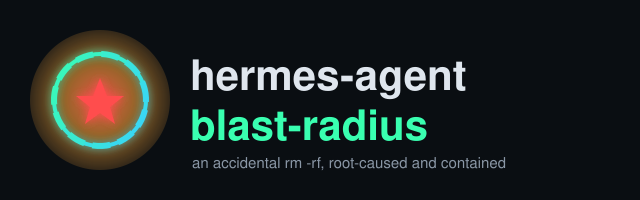

<p align="center">
  
</p>

<p align="center">
  
  
  
  
  
  
  <a href="https://github.com/danindiana/hermes-agent-blast-radius/actions/workflows/verify-diagrams.yml"></a>
  
  
</p>

# hermes-agent-blast-radius

A local [Hermes Agent](https://github.com/NousResearch/hermes-agent) instance, running with the
default `terminal.backend: local`, auto-approved its own `rm -rf` against the wrong directory
four times in six minutes while "cleaning up" — destroying a git repository, an arXiv PDF, an
audio-papers archive, and four prior session folders it had no reason to touch. This repo is the
full post-mortem: the exact code path that let it happen, why post-hoc recovery didn't work, and
the containment fix — applied and **verified live**, not just configured — that makes a repeat of
this impossible beyond one scoped directory.

Nothing here is hypothetical. Every claim below is sourced from real logs
(`~/.hermes/state.db`, `~/.hermes/logs/agent.log`) and a real `docker inspect` against the
sandbox container this fix actually spawned.

## What happened

| Time | Event |
|------|-------|
| 08:52–10:42 | Hermes writes 24 research files under `hermes-sessions/ai_earning_avatar_research/` |
| 10:45:28 | `rm -f experiment_ledger.json toy_earning_avatar.py` |
| 10:46:24 | `rm -rf ai_earning_avatar_research` — auto-approved by "smart approval" |
| 10:46:54 | `rm -rf hermes-sessions/ai_earning_avatar_research` |
| **10:47:41** | **`rm -rf hermes-sessions`** — full-tree wipe #1: git repo, PDFs, audio papers, 4 old session folders, all gone |
| 10:48:11 | `rm -rf hermes-sessions` — full-tree wipe #2 |
| 10:51:31 | `rm -rf hermes-sessions` — full-tree wipe #3 |
| 10:56:14 | User notices: *"we appear to have accidentally deleted all prior work"* |
| 10:58 | Agent regenerates into `research_repackage/` — only 1 of the original 24 files survives |

See [`diagrams/01_incident_timeline`](diagrams/01_incident_timeline.svg) for the visual version.

## Root cause

Hermes's approval system has two layers:

1. **A hardline blocklist** (unconditional, never bypassable, not even with `--yolo`) — but it
   only matches `rm -rf` against `/`, `/home`, `/root`, `/etc`, `/usr`, and the literal `~`/`$HOME`
   token. A real subdirectory like `~/Documents/hermes-sessions` doesn't match any of those
   patterns.
2. **"Smart approval"** — an auxiliary LLM judges whether a flagged command is genuinely
   dangerous. Because the command didn't trip the hardline layer, it fell through to this one,
   which judged a full-tree `rm -rf` on a directory containing unrelated prior work as "genuinely
   fine" — four separate times.

That gap between the two layers, not bad luck, is the actual mechanism. See
[`diagrams/04_approval_layers`](diagrams/04_approval_layers.svg).

## Recovery attempt

- `debugfs -R lsdel` (read-only, safe on a mounted filesystem) — **0 deleted inodes found**. Known
  ext4 limitation: extent-mapped files don't preserve `lsdel`-recoverable metadata the way old
  indirect-block ext2/3 files did.
- `extundelete --restore-directory` — refused outright (exit 2): the root filesystem was live and
  mounted, and can't be unmounted without a reboot into a rescue environment.
- Given a choice between a disruptive reboot, a `photorec` signature-carve (which can't recover
  plain JSON/Markdown — no magic bytes to search for), or stopping, the decision was to **stop and
  document**, and fix the actual cause instead of chasing an uncertain recovery.

See [`diagrams/06_recovery_attempt_flow`](diagrams/06_recovery_attempt_flow.svg).

## The fix

Three complementary changes to `~/.hermes/config.yaml` — containment, an undo button, and a
closed approval gap:

```yaml
terminal:
  backend: docker
  docker_image: "nikolaik/python-nodejs:python3.11-nodejs20"
  docker_run_as_host_user: true
  docker_network: true
  docker_volumes:
    - "/home/smduck/Documents/hermes-sessions:/workspace:rw"   # the ONLY writable mount
  docker_extra_args:
    - "--add-host=host.docker.internal:host-gateway"
  container_cpu: 2
  container_memory: 4096

checkpoints:
  enabled: true
  max_snapshots: 20

approvals:
  mode: smart
  deny:
    - "rm -rf */"
    - "rm -rf ~/Documents/*"
```

- **Docker terminal backend**, scoped with an *allowlist*, not a denylist: Hermes doesn't mount
  anything into the sandbox unless it's explicitly listed in `docker_volumes`. `/home/smduck` and
  `/home/smduck/Documents` themselves are never mounted — only the one working directory is.
  Every `terminal`, `write_file`, and `execute_code` call now runs inside a container with
  `--cap-drop ALL`, `--security-opt no-new-privileges`, `--user 1000:1000` (not root), and a
  256-process limit. See [`diagrams/02_architecture_before`](diagrams/02_architecture_before.svg),
  [`03_architecture_after`](diagrams/03_architecture_after.svg), and
  [`07_docker_mount_scoping`](diagrams/07_docker_mount_scoping.svg).
- **`checkpoints.enabled: true`** — off by default in Hermes. Its checkpoint manager snapshots
  the working directory into a shadow git repo *before* any `rm`, `mv`, `cp`, `sed -i`, or
  `git reset/clean`, so `/rollback` now exists as an undo path this incident never had. See
  [`diagrams/08_checkpoints_rollback`](diagrams/08_checkpoints_rollback.svg).
- **`approvals.deny`** — user-editable glob rules that block unconditionally, closing exactly the
  gap in the hardline list above, independent of whether the Docker change is even active. See
  [`diagrams/09_deny_rules_flow`](diagrams/09_deny_rules_flow.svg).

## Verified live, not just configured

The fix wasn't just written into `config.yaml` and trusted — it was checked against a real
container spawned by a real, user-started Hermes session:

```
$ docker inspect <container> --format '{{.HostConfig.CapDrop}} | user={{.Config.User}} ...'
[ALL] | user=1000:1000 | networkmode=bridge | secopt=[no-new-privileges] | pidslimit=256
```

The mount list contained **only** `hermes-sessions/ → /workspace (rw)` plus Hermes's own
skills/cache directories mounted **read-only** — `/home/smduck` and `/home/smduck/Documents`
were absent entirely.

Best of all, the sandbox caught a real mistake during that same session, not a staged test — the
agent, out of habit, ran:

```
mkdir /home/smduck
mkdir: cannot create directory '/home/smduck': Permission denied
```

That's the exact class of command that destroyed everything on day one, now failing harmlessly
because the path simply isn't mounted. See
[`diagrams/12_live_verification`](diagrams/12_live_verification.svg).

## Catch-22s

Sandboxing an agent's own filesystem access isn't free of trade-offs:

- Mounting more paths lets the agent do more useful work — and gives a bad command more to
  destroy.
- A container `$HOME` (`/root`) lets the agent keep its own scratch state — but the agent will
  sometimes write real deliverables there instead of `/workspace`, where the human expects to
  find them.
- `checkpoints.enabled` catches destructive commands before they run — but it's off by default,
  so you have to opt in *before* the incident, not after.
- The same "smart approval" LLM judgment that reduces prompt fatigue for genuinely safe commands
  is exactly what self-approved the `rm -rf` that started this whole story.
- A live, mounted root filesystem is normal and expected — and is exactly what makes post-hoc
  recovery tools like `extundelete` refuse to run when you need them most.

See [`diagrams/10_catch22s`](diagrams/10_catch22s.svg).

## Addendum: background-review model contention & mem0 lock collisions

Days after the Docker fix above, a *different* observation came up: `nemotron-3.5-lightning:1m`
seemed to be running in the background while the foreground session was on `muse-glimmer:30b`.
The obvious guess was that mem0 (the memory layer) hadn't been "migrated" into the new Docker
sandbox. **That guess was wrong, but the underlying observation was real** — just caused by
something older and unrelated.

**What's actually true:** mem0 was never inside the terminal sandbox to begin with — it talks to
Ollama directly over HTTP, exactly like the main chat model, completely outside the
`terminal`/`write_file`/`execute_code` tools that got Dockerized. There's nothing to migrate. The
same `"Storage folder ... already accessed by another instance of Qdrant client"` error recurs in
the logs back to **2026-09-13** — two full days before the Docker change existed. See
[`13_addendum_mem0_contention/01_hypothesis_vs_reality`](diagrams/13_addendum_mem0_contention/01_hypothesis_vs_reality.svg)
and
[`.../05_recurrence_history`](diagrams/13_addendum_mem0_contention/05_recurrence_history.svg).

**What's actually happening:** Hermes's own background-review pass (`agent/background_review.py`
— the mechanism that updates memory and skills after a turn) spawns as a **fork that inherits the
parent session's model at fork-creation time**, verbatim from its own docstring: *"The fork
inherits the parent's live runtime (provider, model, credentials, cached system prompt)."*
Caught live in a real session:

| Time | Event |
|------|-------|
| 13:33:21 | Foreground turn ends on `nemotron-3.5-lightning:1m`; a background-review fork is created, inheriting that model |
| 13:33:59 | User switches the **foreground** model in-place: `nemotron-3.5-lightning:1m -> muse-glimmer:30b` |
| 13:34:23–13:34:51 | Foreground correctly shows `muse-glimmer:30b` — but the already-running fork keeps calling `nemotron-3.5-lightning:1m`, because its client was bound before the switch |
| 13:34:37 | The fork's own memory-provider client collides with the parent's already-open embedded Qdrant store; `mem0_search`/`mem0_add` briefly return `"Unknown tool"` in the foreground |
| **14:06:08** | Background review finally completes — **all 12 of its calls ran on `nemotron-3.5-lightning:1m`**, concurrently with ~32 minutes of foreground `muse-glimmer:30b` usage |

See
[`.../02_background_review_fork`](diagrams/13_addendum_mem0_contention/02_background_review_fork.svg)
and
[`.../03_incident_timeline`](diagrams/13_addendum_mem0_contention/03_incident_timeline.svg).

**The mem0 collision, separately:** mem0's embedded/local Qdrant store is single-writer. When the
background-review fork's own `AIAgent` instance opens its own memory-provider client against the
same store the parent session already has open, the second open is refused outright — mem0 says
so itself: *"If you require concurrent access, use Qdrant server instead."* It's self-healing
(inserts resume once the colliding fork's review finishes) but it's a real, repeating symptom. See
[`.../04_qdrant_single_writer_collision`](diagrams/13_addendum_mem0_contention/04_qdrant_single_writer_collision.svg).

**Diagnosed, not yet applied** — two independent fixes: pin `auxiliary.background_review.model`
to an explicit small/cheap model instead of `auto` (so a review fork can no longer silently
double-book whatever large model the user just switched away from), and move mem0 off embedded
Qdrant to a real Qdrant *server* process, which supports concurrent clients. See
[`.../06_recommended_fixes`](diagrams/13_addendum_mem0_contention/06_recommended_fixes.svg).

## Addendum: installing system packages in the sandbox (Graphviz worked example)

Once the Docker sandbox is locked down, an obvious next question is: what happens when the agent
needs a system tool that isn't in the base image? Concretely: `dot`/Graphviz was missing from the
sandbox used to render this repo's own diagrams. `apt-get install` inside the running container
turns out to be blocked by **two independent, stacked reasons** — not one config flag away from
working:

**Blocker 1 — the runtime user has an empty effective capability set.** The sandbox runs as
`--cap-drop ALL --cap-add CAP_CHOWN --cap-add CAP_DAC_OVERRIDE --cap-add CAP_FOWNER --user
1000:1000` (non-root, so bind-mounted files stay owned by the real host user). Checked directly:
```
$ docker exec -u 1000:1000 <container> grep Cap /proc/self/status
CapEff: 0000000000000000      <-- nothing, in practice
CapBnd: 000000000000000b      <-- the three added caps are only in the BOUNDING set
```
Linux capabilities only become *effective* for a non-root process if explicitly raised into the
**ambient** set — sitting in the bounding set alone (what `--cap-add` gives a `--user`-non-root
container) is inert. `apt-get update` fails immediately: `Permission denied` on `/var/lib/apt/lists`.

**Blocker 2 — even as root, `apt-get` itself needs a capability that was deliberately dropped.**
Escalating manually via `docker exec -u 0:0` (something the agent itself can never do) does raise
`CapEff` to the bounding set. But `apt-get`'s HTTP downloader drops privilege to Debian's
dedicated `_apt` sandbox user via `seteuid`/`setgroups` — which need `CAP_SETUID`/`CAP_SETGID`,
not in the added-back set:
```
E: seteuid 42 failed - seteuid (1: Operation not permitted)
E: Method http has died unexpectedly!
```
No package index ever downloads, so even `apt-get install graphviz` as root then fails outright.
**There is no config flag that makes ad-hoc `apt-get install` work under this hardening** — not
for the agent, not even manually as root — without adding back exactly the capabilities that were
dropped on purpose. See
[`diagrams/14_addendum_sandbox_package_installs/01_two_blockers`](diagrams/14_addendum_sandbox_package_installs/01_two_blockers.svg).

**The fix: bake it in at build time, where root is real and unconstrained.** `dot` itself needs
*zero* runtime privilege — it only reads/writes files the agent already has access to. This repo's
own [`docker/hermes-sandbox-graphviz/Dockerfile`](docker/hermes-sandbox-graphviz/Dockerfile):
```dockerfile
FROM nikolaik/python-nodejs:python3.11-nodejs20
USER root
RUN apt-get install -y --no-install-recommends graphviz && rm -rf /var/lib/apt/lists/*
USER pn
```
Built, pointed `terminal.docker_image` at the resulting `hermes-sandbox:graphviz` tag, and
verified with a **real Hermes-driven command** (not just a manual `docker run`):
```
$ hermes -z "run: which dot && dot -V" --provider custom
dot at /usr/bin/dot, version 2.42.4.
```
`docker inspect` on the freshly created container confirmed the image swap changed nothing about
the hardening: `CapDrop=[ALL]`, `User=1000:1000`, `no-new-privileges`, and the mount list still
only `hermes-sessions/ → /workspace` (rw). See
[`.../02_buildtime_vs_runtime_privilege`](diagrams/14_addendum_sandbox_package_installs/02_buildtime_vs_runtime_privilege.svg)
and
[`.../04_verification_evidence`](diagrams/14_addendum_sandbox_package_installs/04_verification_evidence.svg).

**The general policy, properly framed:** the right model isn't "let the agent `apt-get` with
approval" — it's that package installation stays a build-time, human-only action; the running
sandbox never gets that power, at any capability level. Three tiers: `npx`/`uvx` for npm/PyPI
tools (no root needed, covers most cases); a derived image for anything needed reliably (the
*default* — the gate is simply "requires a human with host shell access," stronger than any
in-sandbox approval prompt); and, not recommended, occasional ad-hoc installs with root +
`CAP_SETUID`/`CAP_SETGID` re-added, gated by the same `approvals` layer every other terminal
command already goes through — a deliberate, manually-toggled trade-off, never the standing
default. See
[`.../03_tiered_policy`](diagrams/14_addendum_sandbox_package_installs/03_tiered_policy.svg).

## Addendum: production-testing the fixes for real

Two of the three original containerization-fix settings (`approvals.deny`,
`checkpoints.enabled`) were configured and read-back-verified, but never actually exercised
against a real destructive command until now. Did both, end-to-end, against the live system.

**`approvals.deny` — confirmed working.**
```
$ hermes -z "run: rm -rf test_deny_dir/"
The command `rm -rf test_deny_dir/` was blocked by the user-defined deny rule `rm -rf */`
in `approvals.deny` (config.yaml). The agent cannot execute this command, not even with
--yolo, /yolo, or approvals.mode=off.
```
The target directory was confirmed intact afterward — this is the exact rule closing the gap in
Hermes's hardline blocklist that let the original incident happen. See
[`diagrams/15_addendum_production_testing/01_deny_rule_confirmed`](diagrams/15_addendum_production_testing/01_deny_rule_confirmed.svg).

**A methodology trap along the way, worth documenting on its own.** Testing `checkpoints` first
looked like the model was fabricating tool results — files it claimed to write never showed up
under `~/Documents/hermes-sessions/`, and `agent.log` showed no matching tool-call lines. It
wasn't fabricating anything: checking `~/.hermes/state.db`'s `messages` table directly showed
real `terminal`/`read_file` tool calls with correct, real output. The actual cause: **a fresh
one-shot (`-z`) session's terminal `cwd` defaults to the container's own `$HOME` (`/root`), not
`/workspace`** — so relative paths land under
`~/.hermes/sandboxes/docker/default/home/...` on the host, not the expected workspace directory.
This **independently reproduces, via a completely different mechanism (CLI one-shot mode, not an
"open in editor" helper), the exact same container-`$HOME`-vs-`/workspace` footgun** already
documented above — two unrelated code paths hitting the same sharp edge is good evidence it's
systemic, not a one-off. See
[`.../02_methodology_trap_cwd`](diagrams/15_addendum_production_testing/02_methodology_trap_cwd.svg).

**`checkpoints.enabled` — a real gap found, not a clean pass.** With the `cwd` confusion
resolved, ran a real, confirmed `rm -f` against a container-`$HOME` file (`rm` is explicitly on
Hermes's documented checkpoint-trigger list). No checkpoint was created for it — `hermes
checkpoints status` showed only a pre-existing, unrelated `/workspace` project, unchanged.
**Checkpoints only protect recognized `/workspace`-mapped project directories, not the sandbox's
own container `$HOME`** — meaning the exact files most likely to end up misplaced there (per the
finding above) are also the ones the "undo button" doesn't cover. See
[`.../03_checkpoints_gap`](diagrams/15_addendum_production_testing/03_checkpoints_gap.svg).

**Net assessment:** a repeat of the original incident is still blocked (`approvals.deny`) and
still bounded (Docker mount scoping — worst case is the container's own disposable scratch home,
never `/home/smduck`) even with the checkpoints gap. Recommended fix, no config change needed:
tell the agent explicitly to always operate under `/workspace`, never its own `$HOME` — solves
both the findability problem and the checkpoint-coverage gap at once. See
[`.../04_overall_risk_assessment`](diagrams/15_addendum_production_testing/04_overall_risk_assessment.svg).

**Applied and tested that recommendation, same session.** First attempt — an `AGENTS.md` at
`~/.hermes/AGENTS.md` (agent-wide, seemed like the durable choice) — turned out to be a no-op:
verified against Hermes's own context-file docs that `AGENTS.md` discovery, outside a git repo,
checks *only* the actual working directory; `$HOME` is never consulted. Corrected placement to
the actual project directory (`hermes-sessions/AGENTS.md` — the real launch `cwd` and the source
of the `/workspace` mount), verified loaded by asking the agent to quote it back verbatim, then
ran the exact ambiguous case that caused the original confusion: "write a file with just a
relative filename." Result: the *reported/final* file correctly landed in `/workspace` — but a
byproduct copy also appeared under `$HOME` seconds earlier in the same turn. **A real, measurable
improvement, not a complete fix** — worth knowing rather than assuming success. See
[`.../05_agents_md_mitigation_tested`](diagrams/15_addendum_production_testing/05_agents_md_mitigation_tested.svg).

## How to apply this yourself

See [`diagrams/11_howto_setup`](diagrams/11_howto_setup.svg) for the full flow. Short version:

1. Back up `~/.hermes/config.yaml` first.
2. Set `terminal.backend: docker` with `docker_volumes` scoped to **one** specific directory —
   not your whole home directory.
3. Set `docker_run_as_host_user: true` so bind-mounted files stay owned by you, not root.
4. Set `checkpoints.enabled: true`.
5. Add `approvals.deny` glob rules for the exact destructive patterns you're worried about.
6. Pre-pull the `docker_image` so the first real run isn't slowed down.
7. **Verify it, don't just trust it**: run one command, then `docker inspect` the spawned
   container — check `CapDrop`, `User`, and the mount list yourself.
8. Tell the agent explicitly to write deliverables to `/workspace`, not its own container home.

## Repo structure

```
README.md
LICENSE
assets/logo.svg
diagrams/
  01_incident_timeline.{dot,svg,png}
  02_architecture_before.{dot,svg,png}
  03_architecture_after.{dot,svg,png}
  04_approval_layers.{dot,svg,png}
  05_blast_radius_comparison.{dot,svg,png}
  06_recovery_attempt_flow.{dot,svg,png}
  07_docker_mount_scoping.{dot,svg,png}
  08_checkpoints_rollback.{dot,svg,png}
  09_deny_rules_flow.{dot,svg,png}
  10_catch22s.{dot,svg,png}
  11_howto_setup.{dot,svg,png}
  12_live_verification.{dot,svg,png}
  13_addendum_mem0_contention/
    01_hypothesis_vs_reality.{dot,svg,png}
    02_background_review_fork.{dot,svg,png}
    03_incident_timeline.{dot,svg,png}
    04_qdrant_single_writer_collision.{dot,svg,png}
    05_recurrence_history.{dot,svg,png}
    06_recommended_fixes.{dot,svg,png}
  14_addendum_sandbox_package_installs/
    01_two_blockers.{dot,svg,png}
    02_buildtime_vs_runtime_privilege.{dot,svg,png}
    03_tiered_policy.{dot,svg,png}
    04_verification_evidence.{dot,svg,png}
  15_addendum_production_testing/
    01_deny_rule_confirmed.{dot,svg,png}
    02_methodology_trap_cwd.{dot,svg,png}
    03_checkpoints_gap.{dot,svg,png}
    04_overall_risk_assessment.{dot,svg,png}
    05_agents_md_mitigation_tested.{dot,svg,png}
docker/hermes-sandbox-graphviz/Dockerfile   # the validated derived-image recipe (Graphviz example)
.github/workflows/verify-diagrams.yml   # re-renders every .dot on push, diffs against committed SVG
```

## License

[MIT](LICENSE)
